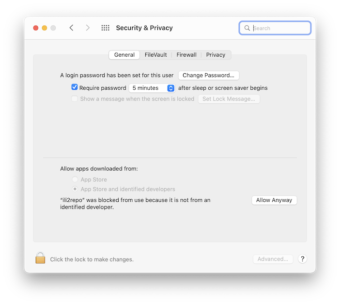
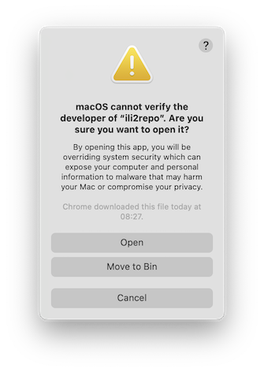

# Benutzerhandbuch

_Ili2repo_ ist ein Kommandozeilentool, das aus einem Verzeichnis (inkl. Unterverzeichnissen) mit INTERLIS-Datenmodellen eine _ilimodels.xml_-Datei für eine INTERLIS-Modellablage erstellt.

## Installation

Es stehen zwei Varianten zum [Download](https://github.com/edigonzales/ili2repo/releases/latest) bereit:

### JVM/Java-Variante

Diese Variante (`ili2repo-<Version>.zip`) benötigt eine installierte Java Runtime 17 oder höher, ist jedoch betriebssystemunabhängig. Die Zip-Datei muss entpackt werden. Im Verzeichnis sind zwei Unterverzeichnisse _lib_ und _bin_. Im _lib_-Verzeichnis sind sämtliche benötigten Java-Bibliotheken. Im _bin_-Verzeichnis ist eine Shellskript-Datei resp. eine Batch-Datei. Diese dienen zur Auführung des Programmes.

Linux/macOS:

```
./bin/ili2repo --help
```

Windows:

```
./bin/ili2repo.bat --help
```

### Native Binaries

Die Native Binaries sind für das jeweilige Betriebssystem kompilierte Versionen, die keine Java Runtime benötigten. Aus diesem Grund muss für jedes Betriebssystem ein separates Binary hergestellt werden. Es stehen Binaries für Windows, Linux und macOS zur Verfügung (siehe Betriebssystemabkürzung im Namen der Zip-Datei). Das macOS-Binary läuft auf Intel wie auch auf Apple Silicon Prozessoren. 

```
./ili2repo --help
```

Im Gegensatz zu der Java-Variante erscheinen beim ersten Aufruf auf macOS und Windows Warnungen wegen fehlender Signierung des Binaries resp. wegen des unbekannten Entwicklers der Software. Man muss dem Betriebssystem das Ausführen des Programms einmalig explizit erlauben. Unter macOS erscheint direkt nach dem erstmaligen Ausführen von `./ili2repo`:


In den "Einstellungen" - "Security & Privacy" - "General" muss man mit "Allow Anyway" die Software entblocken:



Wenn man den obigen Befehl nochmals ausführt, erscheint wieder ein Meldung:



Diese Meldung muss man mit "Open" bestätigen.

## Programm starten

Entweder via Shellskript und Batch-Datei oder direkt das Native Binary aufrufen. Siehe Kapitel "Installation".

Mit `./ili2repo --help` kann die Hilfe angezeigt werden.

### ilimodels.xml erzeugen

Für das Erstellen einer _ilimodels.xml_-Datei muss die Option "--directory" gefolgt vom Verzeichnisnamen mit den Datenmodellen angegeben werden:

```
./ili2repo --directory=path/to/models/
```

Es werden ebenfalls sämtliche Unterverzeichnisse nach Datenmodellen durchsucht. Die _ilimodels.xml_-Datei wird im obersten Verzeichnis erstellt (hier _models_). Sie wird mit _ilivalidator_ geprüft.

Es werden folgende Metaattribute innerhalb des Datenmodells berücksichtigt und in die _ilimodels.xml_-Datei geschrieben:

- `technicalContact`
- `furtherInformation`
- `Title`
- `shortDescription`

Mit der Option `--init` wird im gleichen Verzeichnis eine _ilisite.xml_-Datei erstellt.

Im obersten Verzeichnis (Rootverzeichnis) sollten keine Datenmodele platziert werden, sondern nur in Unterverzeichnissen. Da _ilimodels.xml_ selber ein INTERLIS-Datenmodell ist und zum einem bestimmten Zeitpunkt noch nicht fertig ist, entsteht ein Durcheinander.

Es werden sämtliche Unterverzeichnisse berücksichtigt, so auch _replaced_- oder _obsolete_-Ordner. Bei einem mehr oder weniger offiziellen Konsens werde ich das ändern.

### Server-Modus

Der Servermodus `--server` dient zum Testen der vorgängig erzeugten _ilimodels.xml_-Datei. Es wird dazu ein ganz simpler HTTP-Server gestartet. Die INTERLIS-Modellablage ist unter der Url `http://localhost:8820` verfügbar. Der Servermodus benötigt ebenfalls die Option `--directory`, damit er weiss welches Verzeichnis bereitgestellt werden soll, es wird aber keine _ilimodels.xml_-Datei erstellt.
