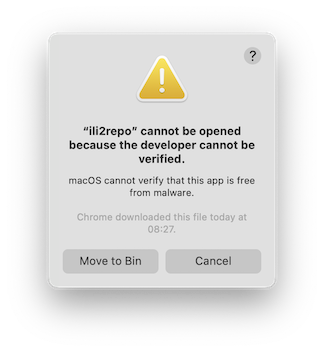

# Benutzerhandbuch

_Ili2repo_ ist ein Kommandozeilentool, das aus einem Verzeichnis (inkl. Unterverzeichnissen) mit INTERLIS-Datenmodellen eine _ilimodels.xml_-Datei für eine INTERLIS-Modellablage erstellt.

## Installation

Es stehen zwei Varianten zum [Download](https://github.com/edigonzales/ili2repo/releases/latest) bereit:

### JVM/Java-Variante

Diese Variante (`ili2repo-<Version>.zip`) benötigt eine installierte Java Runtime 17 oder höher, ist jedoch Betriebssystem unabhängig. Die Zip-Datei muss entpackt werden. Im Verzeichnis sind zwei Unterverzeichnisse _lib_ und _bin_. Im _lib_-Verzeichnis sind sämtliche benötigten Java-Bibliotheken. Im _bin_-Verzeichnis ist eine Shellskript-Datei resp. eine Batch-Datei. Diese dienen zur Auführung des Programmes.

Linux/macOS:

```
./bin/ili2repo --help
```

Windows:

```
./bin/ili2repo.bat --help
```

### Native Binaries

Die Native Binaries sind für das jeweilige Betriebssystem kompilierte Versionen, die kein Java Runtime benötigten. Aus diesem Grund gibt muss für jedes Betriebssystem ein separates Binary hergestellt werden. Es stehen Binaries für Windows, Linux und macOS zur Verfügung (siehe Betriebssystemabkürzung im Namen der Zip-Datei). Das macOS-Binary läuft auf Intel wie auch auf Apple Silicon Prozessoren. 

```
./ili2repo --help
```

Im Gegensatz zu der Java-Variante erscheinen beim ersten Aufruf auf macOS und Windows Warnungen wegen fehlender Signierung des Binaries resp. wegen des unbekannten Entwicklers der Software. Man muss dem Betriebssystem das Ausführen des Programms explizit erlauben. Unter macOS erscheint 




- benötigt java 17 oder neuer

- osx x86 läuft auch auf den Apple Silicon Rechnern.

## Programm starten

- macOS-Meldung... (Windows?)
- keine Meldung auf Linux

### ilimodels.xml erzeugen


### Server-Modus
- im server modus wird kein ilimodels.xml erzeugt,es muss vorgängig erstellt werden.

## Tipps und Tricks

### Metaattribute

### replaced/...


**TODO**:
- ilisite.xml??? --initSite -i für dummy ilisite reinkopieren?


- Tipp: keine Modell im models root Verzeichnis, wo auch das ilimodels.xml zu liegen kommt. Herstellungsnprozess etc. kommt durcheinander.